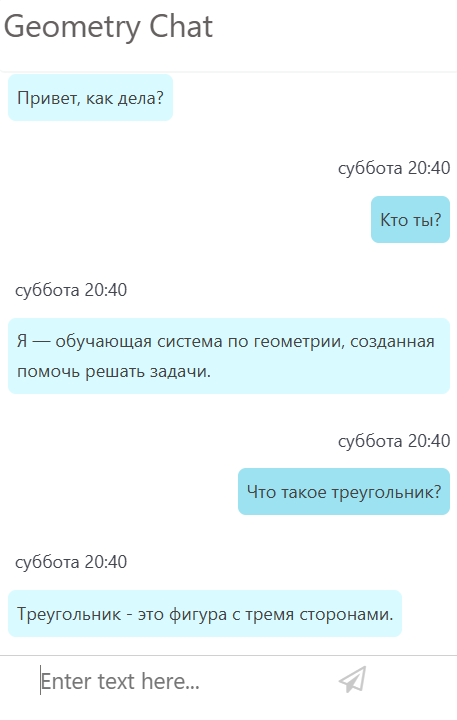

# Чат
В ходе работы с редактором у пользователя могут возникнуть вопросы. Для решения этой задачи и был реализован умный чат-помощник. 

## Ответы на вопросы
Чат-помощник может отвечать на вопросы, касающиеся геометрии. 

На данный момент их количество несколько ограничено, но пополняется.

## Общение
Помимо ответов на вопросы, помощник может поддержать поздороваться и поддержать разговор. Здорово!