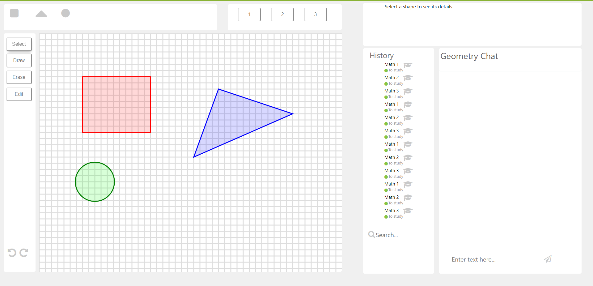
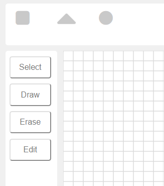
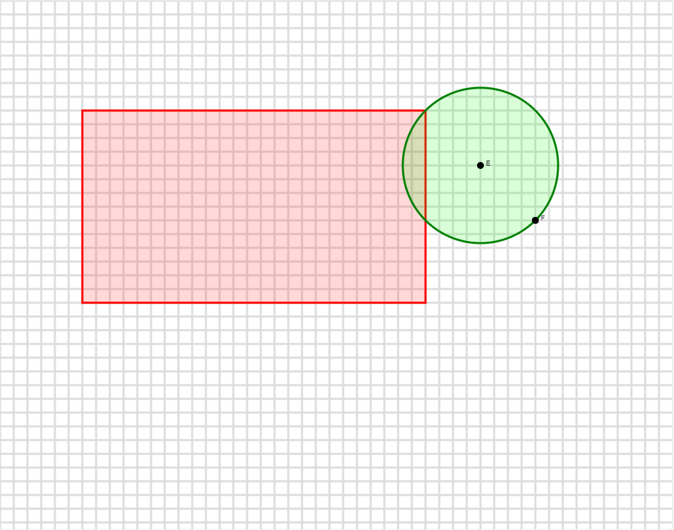
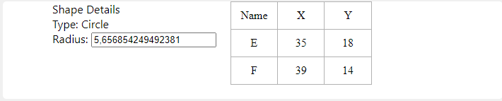

# Графический редактор
Страница с графическим редактором представляет собой набор из нескольких компонентов: панель инструментов, полотно, панель информации о выбранной фигуре.

## Панель инструментов
Панель инструментов состоим из двух дочерних компонентов: панели фигур и панели режимов. Панель режимов состоит из четырёх режимов: выбор, рисование, удаление и редактирование. Выбор позволяет выделить фигуру и узнать подробную информацию о ней. Рисование позволяет добавлять новые фигуры. Удаление убирает нарисованную ранее фигуру. Редактирование позволяет перемещать фигуры.
Панель фигур - панель из трёх элементов: прямоугольник, треугольник, окружность. Здесь пользователь задаёт фигуру, которую он желает изобразить с помощью режима рисования.

## Полотно
Полотно занимает наибольшую часть графического редактора и представляет собой расчерченное в сетку поле. Здесь можно рисовать, изменять и удалять фигуры.

## Панель информации
Эта панель отображает данные о выбранной фигуре. Координаты её точек и иная, свойственная фигуре, информация.

