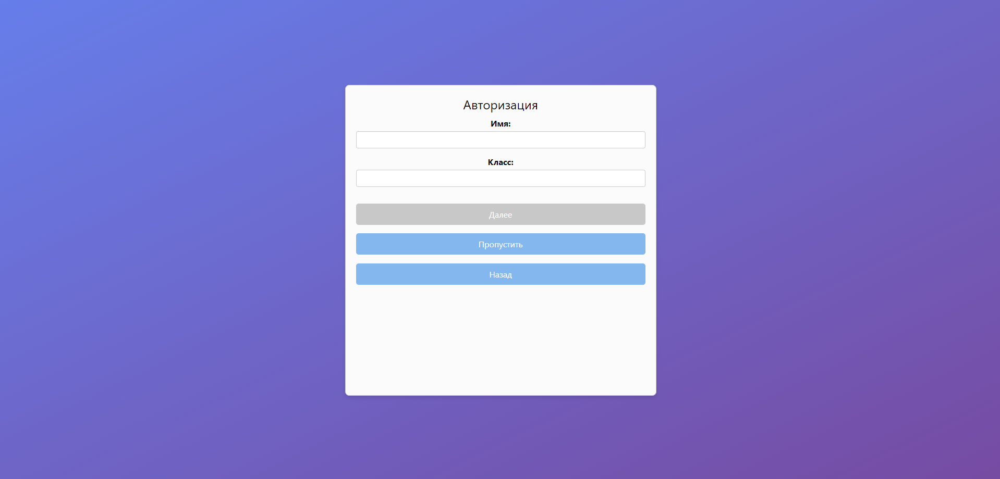

# Authentication Page
Before using the tools, the user must authenticate. This can be done using a third-party provider (currently, only Google accounts are supported) or through the built-in registration function.

During registration, the user can also specify their class. This provides the system with more context about the user's approximate knowledge level.