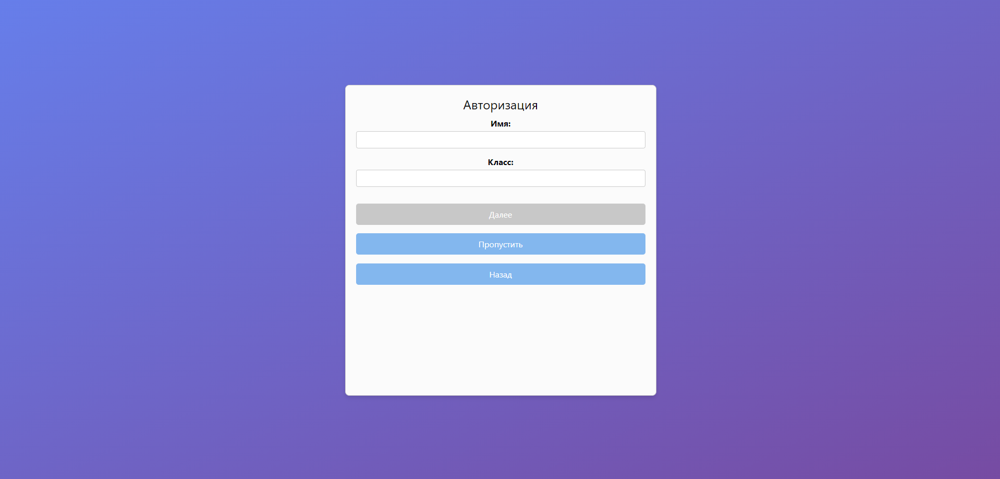

# Страница аутентификации
Перед использованием инструментов пользователь должен пройти аутентификацию. Сделать это необходимо с использованием стороннего провайдера (на данный момент допустимо использование Google аккаунта) или с помощью встроенной функции регистрации.

Также при регистрации пользователь может указать класс, в котором он обучается. Таким образом, система получает больше контекста о примерном уровне знаний пользователя.